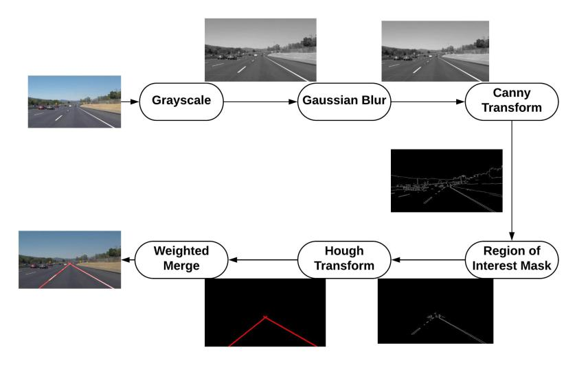
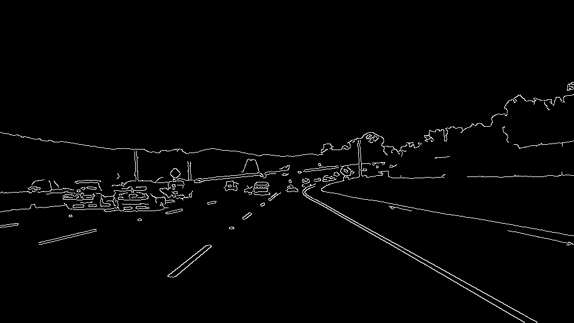
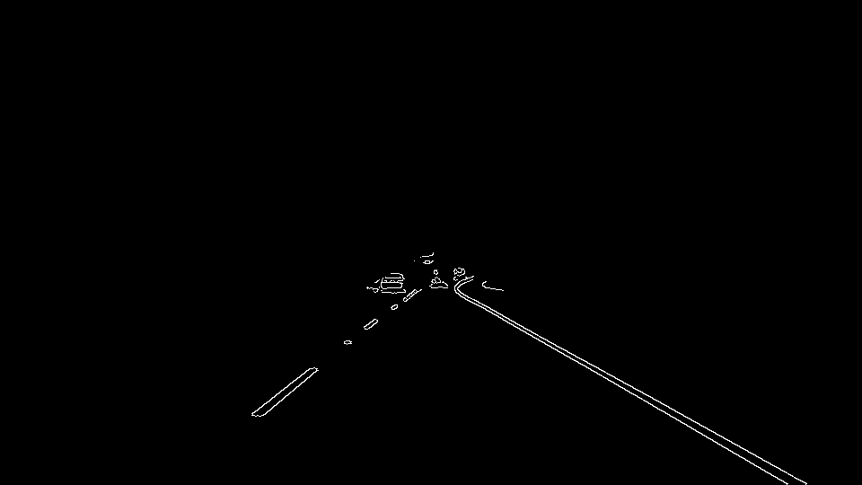
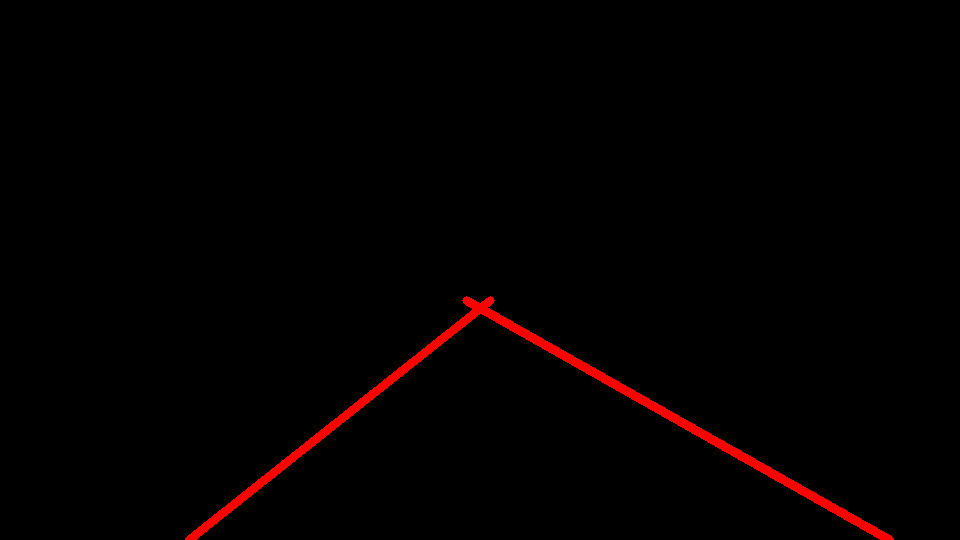

# Self Driving Cars: Finding Lane Lines on the Road

---

## Dependencies
* Python 3.5 or later
* Numpy
* OpenCV
* Matplotlib
* Moviepy

## Using the Pipeline on Images
* Add the orignal image to the test_images folder 
* Run the lane_detection.py file 
* The result images are saved in image_result folder

## Using the Pipeline on Videos
* Add the orignal video to the test_videos folder
* Run the lane_detection.py file
* The result videos are saved in video_result folder

## Pipeline

As shown in the figure the pipeline consists of 6 steps:-

### Convert to Grayscale: 
This will convert the image to a single channel for later use by the Canny Transform (Step 3) for finding the gradient of the pixel intensity.

### Apply Gaussian Smoothing (or Gaussian Blur): 
This step filters out the noise in the image.

### Apply Canny Transform: 
This is used to find the edges in the image. An edge is formed by pixels where the gradient of the image intensity sharply changes.

### Find the Region of Interest: 
This step separates out the region of image where the road lanes are possible to occur.

### Apply Hough Transform: 
This step separates out the lines in the image that probably form the lanes.

### Merge with the Original Image: 
This step merges the output of the hough transform to the original image.

##

##

## For more information and results
https://wp.me/p9KXJx-T

## Contributers
Avinash Sharma: avinashmnit30@gmail.com

## License and Copyright
© Avinash Sharma

